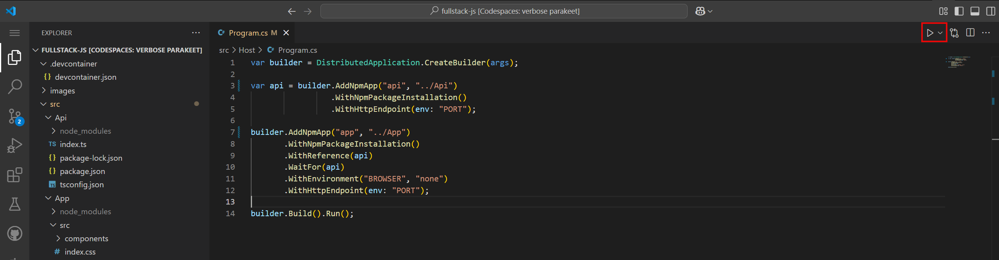
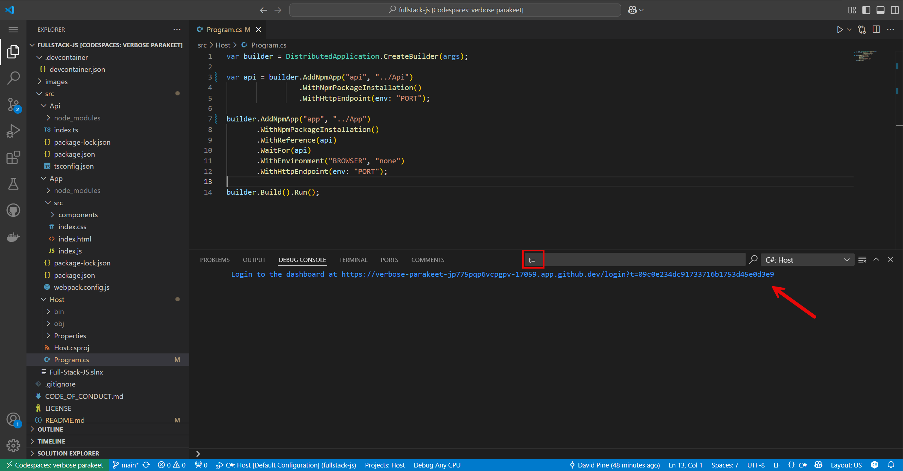
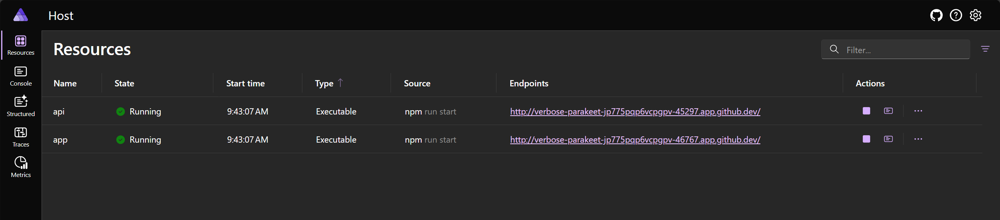
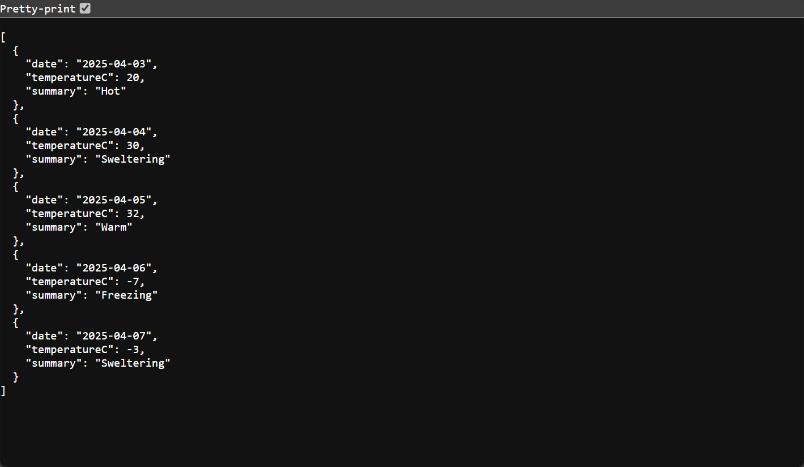
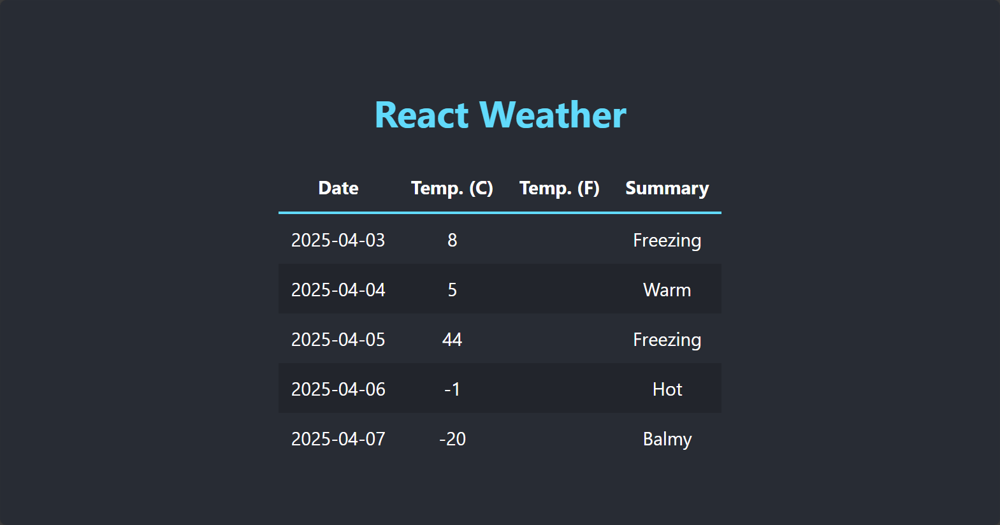

# C# Aspire 💜 Full Stack JS

To get started, select the following "Open in GitHub Codespaces" button:

[](https://codespaces.new/IEvangelist/fullstack-js)

## 🗺️ Quick tour

This repository provides a CodeTour experience. To start the tour, expand the CodeTour tab under the **Explorer** pane on the left side of the screen. Select the **Quick tour** option and press the **Start tour** button.

While in the tour, navigate through the tour using the **Next** and **Previous** buttons.

## ✅ Run the app

You can run this app locally after cloning this repository, or you can run it in GitHub Codespaces. This repository is configured to run in GitHub Codespaces, so you can get started quickly.

To start the app host, you can use the integrated terminal or you can use the built-in debugger experience.

### 🧑‍💻 Integrated terminal

1. Open the integrated terminal (<kbd>Ctrl</kbd>+<kbd>`</kbd>) and run the following command:

   ```dotnetcli
   dotnet run --project ./src/Host/Host.csproj
   ```

   This runs the app host project, which orchestrates the API and App together.

### 🐛 Debugger experience

1. Open the _src/Host/Program.cs_ file, and select the Play button near the top-right corner of the screen:

   

    This will start the app host project in debug mode, which orchestrates the API and App together.

Regardless of which method you choose, the app host will start up and the debug console will display output. The .NET Aspire dashboard launches in a new browser tab, but it doesn't include the generated login token. You can find the token in the debug console output by applying this search filter `t=`, as shown in the following image:



Select the URL in the debug console output to open the dashboard in a new browser tab. The URL will look something like this:



If you select the endpoint for the API, it opens in a new browser tab but doesn't display any data. Append the `/weatherforecast` route to the URL to see the sample data returned by the API. The URL will look something like this:



Select the endpoint for the App, and it opens in a new browser tab. The URL will look something like this:



## 🤓 Conclusion

This is a simple example of how to use .NET Aspire to demonstrate a full stack JavaScript application. It exposes an API that returns a weather forecast and a React app that consumes the API. The app host orchestrates the API and App together, making it easy to develop and test full stack applications with .NET Aspire.

To learn more, see [.NET Aspire](https://learn.microsoft.com/dotnet/aspire/).
